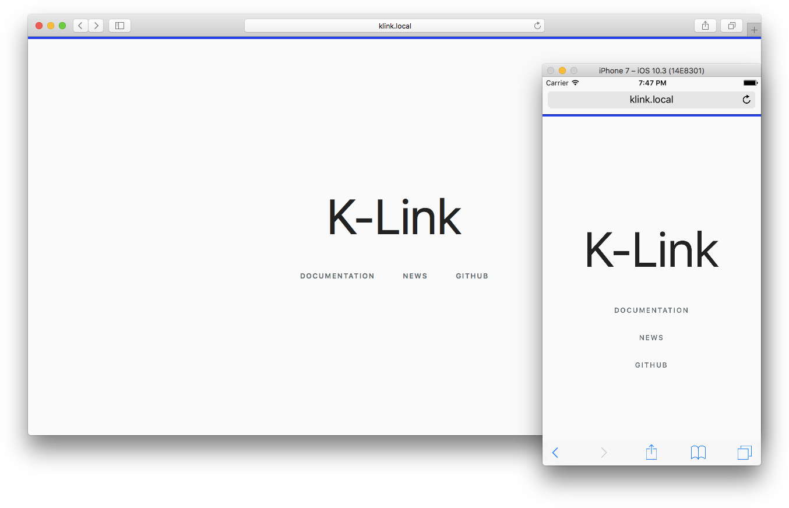

# K-Link

The K-Link is a document network that connects different [K-Boxes](https://git.klink.asia/main/k-box) or 
other clients to enable knowledge sharing and retrieval.

## Getting started with K-Link

K-Link is made up by different components:

- The [K-Link Explore site](./docs/website.md), contained in this repository
- The [K-Link Registry](https://git.klink.asia/main/k-link-registry) for controlling who can access 
  the network and publish documents
- The [K-Search API](https://git.klink.asia/main/k-search), for adding, searching and removing documents
- And the optional [K-Link Video Streaming Service](https://git.klink.asia/main/video-streaming-service) if video playback on Mobile devices is needed

### Installation

K-Link can be installed on most Operating Systems. The current suggested approach is to use [Docker](https://www.docker.com/) and the [K-Setup](https://git.klink.asia/main/k-setup) utility.

**Requirements**

In order to run the K-Link

- 64bit Operating System supported by Docker (e.g. Debian, Ubuntu,...)
- [Docker](https://www.docker.com/) and Docker compose
- A modern web browser (e.g. Edge 15+, Chrome, Firefox, Safari, Opera together with their mobile counterparts)
- At least 4GB of free hard drive space for the installation
- 4GB of RAM (8GB is better)
- An Intel Core i5 processor

[Learn more about how to install a K-Link instance](./docs/installation.md)

## K-Link Explore 

K-Link Explore is a static website that is included with a K-Link deployment as a courtesy webpage.

[Learn more about K-Link Explore](./docs/website.md)

## Contribution

Thank you for considering contributing to the K-Link!

The contribution guide is not available yet, but in the meantime you can still submit Pull Requests.

## License

The K-Link components are generally licensed with AGPL v3 unless specified differently in the respecting repositories.
